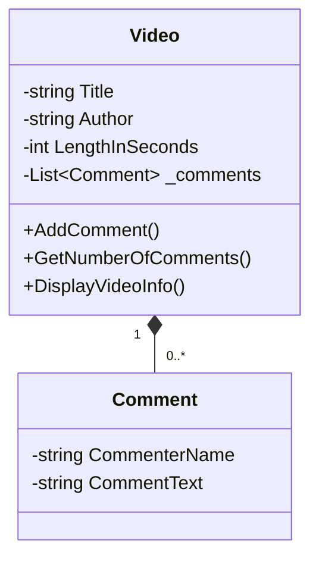
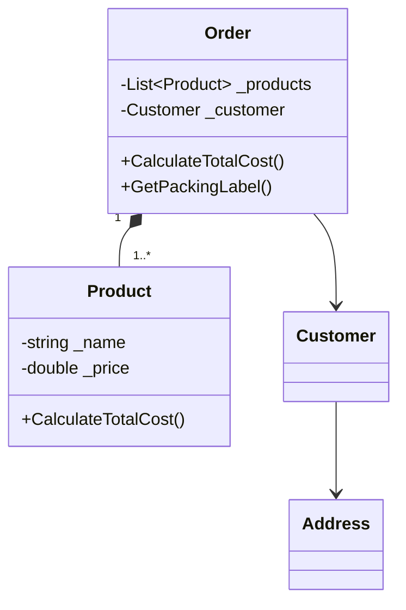

# CSE 210 - Foundation Programs Design  
*Design Document for Week 4 Assignments*  

---

## **1. YouTube Video Program (Abstraction)**  

### **Class Design Table**  

| Class       | Responsibilities               | Methods                          | Attributes                          |
|-------------|--------------------------------|----------------------------------|-------------------------------------|
| `Video`     | Stores video metadata and comments | `AddComment()`<br>`GetNumberOfComments()`<br>`DisplayVideoInfo()` | `Title` (string)<br>`Author` (string)<br>`LengthInSeconds` (int)<br>`_comments` (List\<Comment\>) |
| `Comment`   | Stores comment data            | *None*                          | `CommenterName` (string)<br>`CommentText` (string) |

### **Class Diagram**  


### **Code Snippets**  
#### `Video.cs`
```csharp
public class Video {
    private List<Comment> _comments = new List<Comment>();
    public void AddComment(string name, string text) => 
        _comments.Add(new Comment(name, text));
    // ... (other methods)
}
```

#### `Comment.cs`
```csharp
public class Comment {
    public string CommenterName { get; }
    public string CommentText { get; }
    // ... (constructor)
}
```

---

## **2. Online Ordering Program (Encapsulation)**  

### **Class Design Table**  

| Class       | Responsibilities               | Methods                          | Attributes                          |
|-------------|--------------------------------|----------------------------------|-------------------------------------|
| `Order`     | Manages products and calculates totals | `CalculateTotalCost()`<br>`GetPackingLabel()`<br>`GetShippingLabel()` | `_products` (List\<Product\>)<br>`_customer` (Customer) |
| `Product`   | Stores product details         | `CalculateTotalCost()`           | `_name` (string)<br>`_price` (double)<br>`_quantity` (int) |
| `Customer`  | Links customer to address      | `LivesInUSA()`                   | `_name` (string)<br>`_address` (Address) |
| `Address`   | Stores location data           | `IsInUSA()`<br>`GetFullAddress()` | `_street` (string)<br>`_city` (string)<br>`_country` (string) |

### **Class Diagram**  


### **Code Snippets**  
#### `Order.cs`
```csharp
public class Order {
    public double CalculateTotalCost() {
        double total = _products.Sum(p => p.CalculateTotalCost());
        return total + (_customer.LivesInUSA() ? 5 : 35);
    }
    // ... (other methods)
}
```

#### `Address.cs`
```csharp
public class Address {
    public bool IsInUSA() => _country.Equals("USA", StringComparison.OrdinalIgnoreCase);
    // ... (other methods)
}
```

---


*Designed by Nuno Ferreira,  CSE 210 - Week 4 Foundation Programs*  